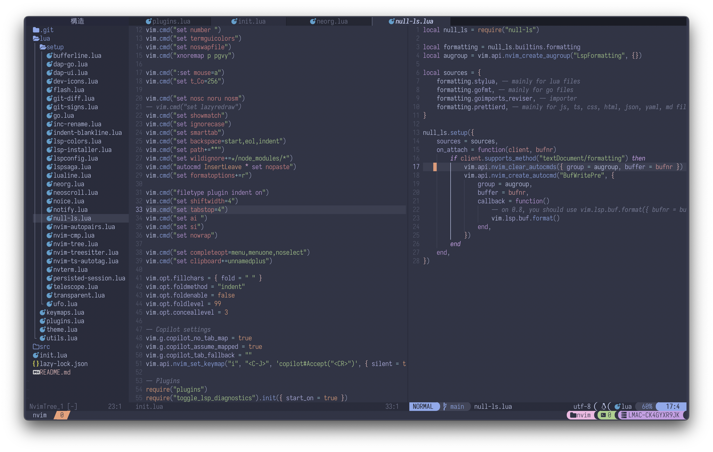

## Personal neovim settings. Clone this in case settings are needed.

- Install packer
  `https://github.com/wbthomason/packer.nvim`

  | Notes: If nvim-norg compilation gives error in arm64 consider installing gcc-11 and running the following `CC=gcc-11 nvim -c "TSInstall norg"`

  

## Recommended npm global packages

- @fsouza/prettierd _installed through npm_
- stylua _installed as package depending on os_

### If telescope running slow make sure to have this dependencies installed

- fd
- plocate or locate ( findutils )
- bat

For python it is better to run pip3 istall --upgrade neovim
